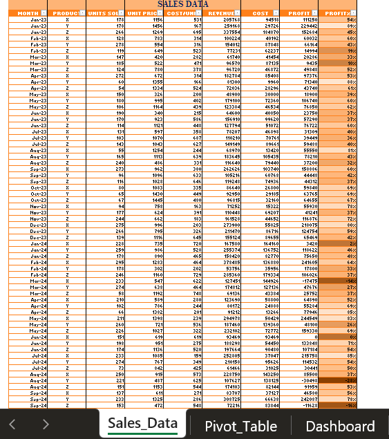
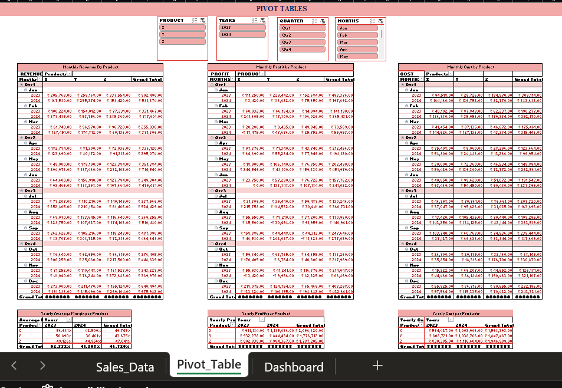
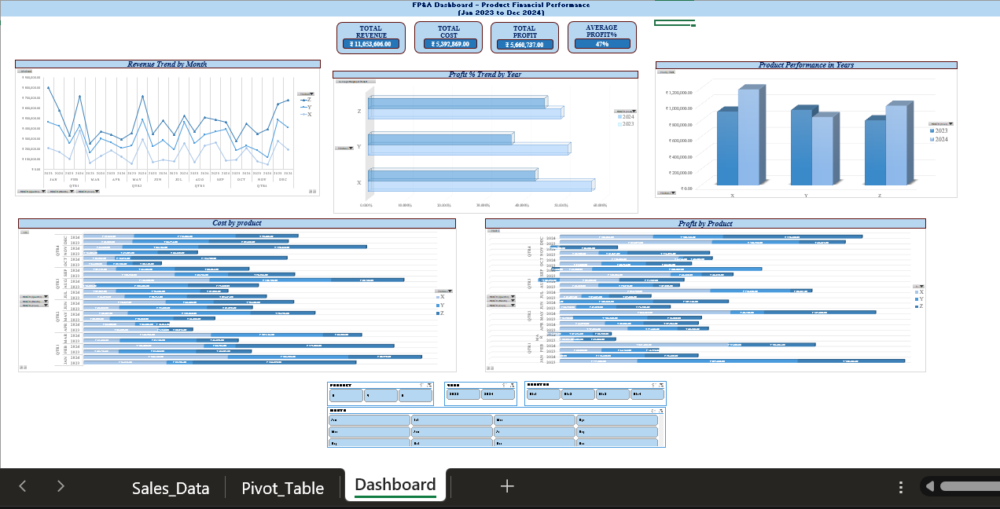

#  FP&A Dashboard – Product Financial Performance (Excel Power Pivot)

This project is a **Product Financial Performance Dashboard** built in **Microsoft Excel (Power Pivot)**. It visualizes sales data over a 24-month period (Jan 2023 – Dec 2024) and tracks KPIs like **Revenue**, **Cost**, **Profit**, and **Profit %** across products.

The dashboard is interactive and suitable for financial reporting, monthly product analysis, and stakeholder presentations.

---

##  Compatibility Note

> This dashboard uses **Power Pivot and Data Model features**, which require:
> - Microsoft Excel **2013 or later**
> -  **Desktop Excel app**
>
>  **Not supported** in Excel Online, mobile apps, or versions older than Excel 2013.

---

##  Project Contents

| File | Description |
|------|-------------|
| `FP&A_DASHBOARD_Project_Rasviya.xlsx` | Excel dashboard with slicers, Power Pivot, KPIs |
| `FP&A Dashboard project` | Walkthrough demo video | link available below
|  [View via OneDrive](https://onedrive.live.com/personal/7c0e3f80c8b9fdd2/_layouts/15/doc2.aspx?sourcedoc=%7Bb4254fc9-f149-445e-bc17-600a36b82487%7D&action=default&redeem=aHR0cHM6Ly8xZHJ2Lm1zL3gvYy83YzBlM2Y4MGM4YjlmZGQyL0VjbFBKYlJKOFY1RXZCZGdDamE0SkljQnEybGxHSndtaEZsNXE2TS1tVm9CVXc_ZT1nenVxdk4&slrid=8593aca1-503f-0000-c7fe-453adccb8a3f&originalPath=aHR0cHM6Ly8xZHJ2Lm1zL3gvYy83YzBlM2Y4MGM4YjlmZGQyL0VjbFBKYlJKOFY1RXZCZGdDamE0SkljQnEybGxHSndtaEZsNXE2TS1tVm9CVXc_cnRpbWU9MEI1eksxUzIzVWc&CID=28b049f9-0397-45c5-a892-c949f58fdd9d&_SRM=0:G:40) | Alternate access via OneDrive |

---

##  Demo Video

> Walkthrough video of the dashboard.

---

## Screenshots

| Raw Sales Data | Pivot Table | Final Dashboard |
|----------------|-------------|-----------------|
|  |  |  |

---

## Tools & Techniques Used

- Excel (Power Pivot, PivotTables, Slicers)
- Power Query for data shaping
- GETPIVOTDATA for dynamic KPI calculation
- Conditional formatting
- Interactive dashboard layout

---

## Key Metrics Tracked

- **Units Sold**
- **Unit Price**
- **Cost per Unit**
- **Revenue**
- **Total Cost**
- **Profit & Profit %**
- Monthly and Product-level performance

---

## Skills Demonstrated

- Financial data analysis
- Power Pivot modeling
- Excel automation & dynamic KPI extraction
- Dashboard storytelling for business users
- Time-series based product analysis

---

## About Me

**Rasviya Sulthana**  
Aspiring Financial Data Analyst  
Skilled in Excel, SQL, Power BI, and Financial Reporting

Link: [LinkedIn](https://www.linkedin.com/in/rasviyasulthana)

---

## Contact

Want to collaborate or have questions?  
Feel free to connect with me on [LinkedIn](https://www.linkedin.com/in/rasviyasulthana)

---

